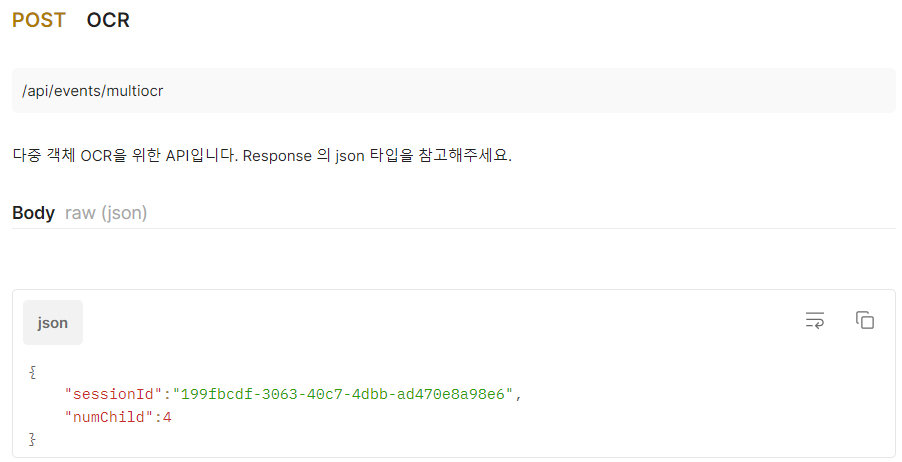

# :runner: 상호작용 AI 안전 교육 서비스, U-AI

인공지능 영상 기술을 활용한 아동 대상 상호작용 AI 동화 안전 교육 서비스

 

## :books: 목차

1. [프로젝트 개요](#speech_balloon-프로젝트-개요)

2. [주요 기능](#loudspeaker-주요-기능)

3. [기대 효과](#sunny-기대-효과)

4. [기술 스택](#black_nib-기술-스택)

5. [시스템 아키텍처](#open_file_folder-시스템-아키텍처)

6. [와이어 프레임](#microscope-와이어-프레임)

7. [요구사항 명세서](#memo-요구사항-명세서)

8. [API 명세서](#pencil2-api-명세서)

9. [결과물](#trophy-결과물)

10. [팀원 소개](#family-팀원-소개)

 

## :speech_balloon: 프로젝트 개요

- 진행 기간 : 2023.08.21 ~ 2023.10.06

- 프로젝트 목표 : 인공지능 영상 기술을 활용하여 어린이들이 직접 참여하며 진행하는 안전 교육 서비스를 개발합니다.

- 기획 배경 : 어린이들에게 필수적인 안전 교육을 단체 상호작용을 통해 진행함으로써 아동의 흥미와 참여도를 제고하고자 합니다.

 

## :loudspeaker: 주요 기능

### 랜딩 페이지

- 교육을 받는 단체 이름과 인원 수를 입력 받습니다.

 

### 메인페이지

- 소방, 예절, 교통 교육 중 테마를 선택할 수 있으며, `?` 아이콘을 클릭하면 진행 방법을 설명하는 튜토리얼을 확인할 수 있습니다.

 

### 튜토리얼

- 상호작용을 통해 진행되는 부분에 대해 튜토리얼을 통해 진행 방법을 안내합니다.

 

### 스토리 진행

- 학습 목표와 준비물을 포함한 표지를 통해 교육 시작 전 흥미를 유발합니다.

- 다중 객체 인식을 통해 사람 수를 파악하여 스토리를 진행합니다.

- STT를 활용하여 아동이 소리를 외치면 정확도를 판단하여 다시 외치도록 유도하거나, 다음 페이지로 이동합니다.

- 판다의 동작을 따라하고, 정확도를 판단하여 정확한 동작을 하면 다음 페이지로 이동합니다.

- 퀴즈의 정답을 화이트보드에 작성하면, 이를 인식하여 몇 명이 정답을 맞혔는지 제공합니다.

- 친근한 판다 캐릭터를 통해 아동들의 관심을 유도합니다.

- 활동 사진을 스토리 마지막에 제공하며, 클릭 시 사진 파일 다운로드가 가능합니다.

 

## :sunny: 기대 효과

- 아동에게 필수적인 안전 교육을 실제 활동을 통해 더욱 효과적으로 학습할 수 있습니다.

- 어린이집 등 단체 교육에 용이하게 활용 가능합니다.

- 상호작용을 통한 직접적인 참여로 아이들의 흥미를 유발할 수 있습니다.

 

## :black_nib: 기술 스택

- Front-end :  `React`, `Next.js`, `TypeScript`, `Three.js`, `Styled-component`

- Back-end : `JAVA`, `Spring Boot`, `Django`, `Pytorch`

- 협업 Tool : `GitLab`, `JIRA`, `Notion`, `MatterMost`, `Discord`, `Figma`

 

## :open_file_folder: 시스템 아키텍처

 

## :microscope: 와이어 프레임

 

## :memo: 요구사항 명세서

 

## :pencil2: API 명세서

 

## :trophy: 결과물

- [중간 발표 자료](https://drive.google.com/file/d/1HFNwo7lHW85fRsJFJW48vq73_kQEnRpQ/view?usp=drive_link)
- [최종 발표 자료](https://drive.google.com/file/d/1SAf3oBKZLmWy3u49IUph8HGWM52VC65J/view?usp=drive_link)

 

## :family: 팀원 소개

- **이강민** : BE

- **곽은정** : FE

- **전대현** : FE

- **정근모** : BE

- **정영록** : FE

- **정훈석** : FE
